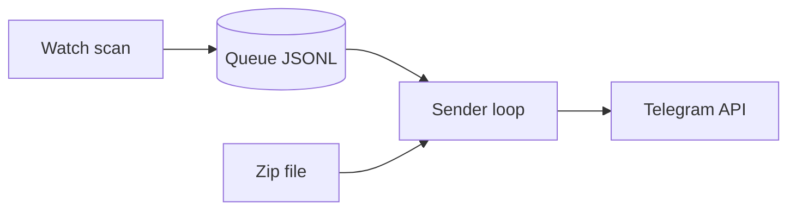

# telegram-upload-watcher
Monitor and send organized folder contents to Telegram channel, group or user/监控文件夹整理发送到telegram的channel 或者群组或者用户

## Setup / 安装
Python (uv):
```bash
uv sync
```

Go build:
```bash
go build -o telegram-send-go ./go
```

## Config / 配置 (INI)
```ini
[Telegram]
api_url = https://api.telegram.org

[Token1]
name = default
id = main
token = 123456:ABCDEF
```
Example file: `config.example.ini` / 示例文件：`config.example.ini`

## CLI / 命令行
This project provides two compatible CLIs / 本项目提供两个兼容的命令行:
- `telegram-send` (Python, from `uv sync`) / Python 版本
- `telegram-send-go` (Go binary) / Go 版本

Set `CLI` before running commands / 先设置 CLI:
```bash
# Python
CLI=telegram-send
# Go
CLI=./telegram-send-go
```

Send a text message / 发送文本消息:
```bash
$CLI send-message \
  --chat-id "-1001234567890" \
  --message "Hello from telegram-upload-watcher" \
  --config ./config.example.ini
```

Show version / 查看版本:
```bash
$CLI version
```

Send images from a directory / 发送目录图片:
```bash
$CLI send-images \
  --chat-id "-1001234567890" \
  --image-dir /path/to/images \
  --config ./config.example.ini
```

Compress images in a folder / 压缩文件夹图片:
```bash
uv run telegram-compress-images /path/in /path/out \
  --max-dimension 2000 \
  --max-size 1M \
  --workers 4
```

Send multiple image sources / 发送多个图片来源:
```bash
$CLI send-images \
  --chat-id "-1001234567890" \
  --image-dir /path/to/images1 \
  --image-dir /path/to/images2 \
  --zip-file /path/to/images.zip \
  --config ./config.example.ini
```

Send a file / 发送文件:
```bash
$CLI send-file \
  --chat-id "-1001234567890" \
  --file /path/to/report.pdf \
  --config ./config.example.ini
```

Send multiple files / 发送多个文件:
```bash
$CLI send-file \
  --chat-id "-1001234567890" \
  --file /path/to/report1.pdf \
  --file /path/to/report2.pdf \
  --config ./config.example.ini
```

Send videos / 发送视频:
```bash
$CLI send-video \
  --chat-id "-1001234567890" \
  --dir /path/to/videos \
  --include "*.mp4" \
  --config ./config.example.ini
```

Send audio / 发送音频:
```bash
$CLI send-audio \
  --chat-id "-1001234567890" \
  --dir /path/to/audio \
  --include "*.mp3" \
  --config ./config.example.ini
```

Send images from a zip / 发送压缩包图片:
```bash
$CLI send-images \
  --chat-id "-1001234567890" \
  --zip-file /path/to/images.zip \
  --config ./config.example.ini
```

Send encrypted zip images / 发送加密压缩包图片:
```bash
$CLI send-images \
  --chat-id "-1001234567890" \
  --zip-file /path/to/secret.zip \
  --zip-pass "pass1" \
  --zip-pass "pass2" \
  --zip-pass-file ./passwords.txt \
  --config ./config.example.ini
```

Scan a directory with zip support / 目录扫描含 zip:
```bash
$CLI send-images \
  --chat-id "-1001234567890" \
  --image-dir /path/to/images \
  --enable-zip \
  --zip-pass-file ./passwords.txt \
  --include "*.jpg" \
  --exclude "*.tmp" \
  --config ./config.example.ini
```

Watch folder / 监控文件夹:
```bash
$CLI watch \
  --watch-dir /path/to/watch \
  --chat-id "-1001234567890" \
  --config ./config.example.ini \
  --with-image \
  --with-video \
  --notify
```

Watch multiple folders / 监控多个文件夹:
```bash
$CLI watch \
  --watch-dir /path/to/watch1 \
  --watch-dir /path/to/watch2 \
  --chat-id "-1001234567890" \
  --config ./config.example.ini \
  --with-image
```

## Workflow / 工作流程
The watch mode scans folders, pushes files into a queue, then sends in batches.
watch 模式会扫描目录 -> 入队 -> 批量发送。



## More examples / 更多示例
Watch recursively with include/exclude + zip passwords / 递归监控 + 过滤 + zip 密码:
```bash
$CLI watch \
  --watch-dir /data/incoming \
  --recursive \
  --include "*.jpg" \
  --exclude "*.tmp" \
  --zip-pass-file ./passwords.txt \
  --queue-file ./queue.jsonl \
  --chat-id "-1001234567890" \
  --config ./config.example.ini
```

Filter files inside a zip / 过滤 zip 内部文件:
```bash
$CLI send-images \
  --chat-id "-1001234567890" \
  --zip-file /path/to/images.zip \
  --include "*.png" \
  --exclude "*_thumb.*" \
  --config ./config.example.ini
```

Useful options / 常用参数:
- `--image-dir` image directory (repeatable) / 图片目录 (可重复)
- `--zip-file` zip file (repeatable) / zip 文件 (可重复)
- `--file` file path (repeatable) / 文件路径 (可重复)
- `--dir` directory path (repeatable) / 目录路径 (可重复)
- `--watch-dir` watch folder (repeatable) / 监控目录 (可重复)
- `--recursive` enable recursive scan / 递归扫描
- `--include "*.jpg"` glob includes (repeatable) / 包含规则 (可重复)
- `--exclude "*.tmp"` glob excludes (repeatable) / 排除规则 (可重复)
- `--enable-zip` include zip files when scanning directories / 扫描目录时处理 zip
- `--zip-pass "secret"` zip password (repeatable; works with --zip-file/--enable-zip/watch) / zip 密码 (可重复; 适用于 --zip-file/--enable-zip/watch)
- `--zip-pass-file passwords.txt` zip password file (one per line) / zip 密码文件 (每行一个)
- `--with-image` watch images / 监控图片
- `--with-video` watch videos / 监控视频
- `--with-audio` watch audio / 监控音频
- `--all` watch all files (images use media groups) / 监控所有文件(图片走 media group)
- `--topic-id 3` send to topic/thread / 发送到话题
- `--scan-interval 30` scan interval seconds / 扫描间隔秒
- `--send-interval 30` send interval seconds / 发送间隔秒
- `--queue-file queue.jsonl` queue persistence file / 队列持久化文件
- `--settle-seconds 5` wait for file stability / 文件稳定等待
- `--pause-every 100` pause after N images / 每发送 N 张暂停
- `--pause-seconds 60` pause duration / 暂停时长
- `--max-dimension 2000` max image dimension / 最大边
- `--max-bytes 5242880` max image bytes before PNG compress / 超过则 PNG 压缩
- `--png-start-level 8` PNG compress start level / PNG 压缩起始等级
- `--notify` enable watch notifications / 开启监控通知
- `--notify-interval 300` status interval seconds / 状态通知间隔秒

Note / 说明:
`--zip-pass` and `--zip-pass-file` apply to encrypted zips found by `--enable-zip` and watch mode too.
`--zip-pass` 和 `--zip-pass-file` 也适用于 `--enable-zip` 或 watch 扫描到的加密 zip。
The queue file writes a metadata header on the first line (watch dir/chat/topic/include/exclude/types). Reusing the same queue with different parameters exits with an error; use a new `--queue-file` or delete the old queue.
队列文件首行会写入运行参数元数据（监控路径/聊天/topic/过滤/类型）。使用不同参数复用同一个队列会报错退出；请改用新的 `--queue-file` 或删除旧队列。

Filtering rules / 过滤规则:
- If `--include` is empty, everything is included by default.
- `--exclude` always wins (include first, then exclude).
- `--include` 为空时默认包含全部；`--exclude` 永远优先级更高。

## Build Tools / 构建工具
Just:
```bash
just build
```

Make:
```bash
make build
```

GoReleaser (snapshot):
```bash
goreleaser release --snapshot --clean
```

## GUI (Wails) / 图形界面
The Go GUI lives under `go/gui` and uses Wails + Svelte + Skeleton UI.
GUI includes tabs for Watch and one-off Send (images/files/video/audio).

Requirements:
- Go 1.24+
- Node.js + npm
- Wails CLI (`wails`) via `go install github.com/wailsapp/wails/v2/cmd/wails@latest`
- Linux build deps (Ubuntu): `sudo apt install libgtk-3-dev libwebkit2gtk-4.0-dev pkg-config`

Dev:
```bash
cd go/gui
wails dev
```

Build:
```bash
cd go/gui
wails build
```

Ubuntu 24.04+ (webkit2gtk 4.1):
```bash
cd go/gui
wails build -tags webkit2_41
```
